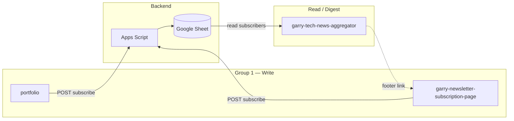
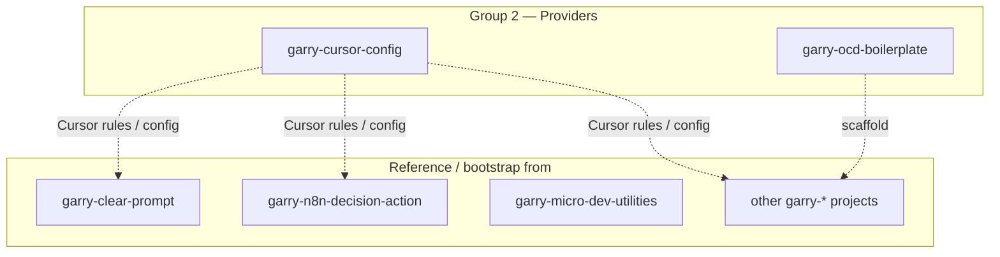
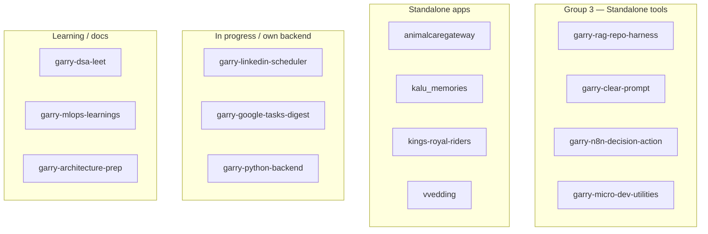
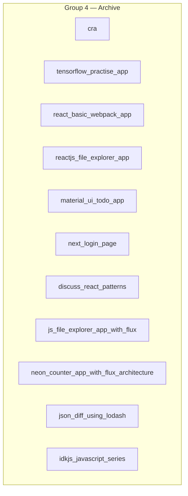

# GitHub Repos, Live Demos & Design Connectivity

**Repo count: 30** (matches [GitHub profile](https://github.com/girijashankarj))

---

## 1. GitHub repositories

### Live (recent / active)

| Project | Repo | Tech |
|--------|------|------|
| Animal Care Gateway | [animalcaregateway](https://github.com/girijashankarj/animalcaregateway) | React, Vite, Tailwind, TypeScript |
| RAG Repo Harness | [garry-rag-repo-harness](https://github.com/girijashankarj/garry-rag-repo-harness) | TypeScript, RAG, LLM |
| Tech News Aggregator | [garry-tech-news-aggregator](https://github.com/girijashankarj/garry-tech-news-aggregator) | TypeScript, RSS, GitHub Actions |
| Cursor Config | [garry-cursor-config](https://github.com/girijashankarj/garry-cursor-config) | Config, Cursor IDE |
| Clear Prompt | [garry-clear-prompt](https://github.com/girijashankarj/garry-clear-prompt) | TypeScript, React |
| Micro Dev Utilities | [garry-micro-dev-utilities](https://github.com/girijashankarj/garry-micro-dev-utilities) | TypeScript, Node, Vite |
| N8N Decision Action | [garry-n8n-decision-action](https://github.com/girijashankarj/garry-n8n-decision-action) | TypeScript, React, N8N |
| OCD Boilerplate | [garry-ocd-boilerplate](https://github.com/girijashankarj/garry-ocd-boilerplate) | TypeScript, Node, Boilerplate |
| Newsletter Subscription | [garry-newsletter-subscription-page](https://github.com/girijashankarj/garry-newsletter-subscription-page) | React, Vite, Tailwind |
| Kalu Memories | [kalu_memories](https://github.com/girijashankarj/kalu_memories) | HTML, CSS, JavaScript |
| Kings Royal Riders | [kings-royal-riders](https://github.com/girijashankarj/kings-royal-riders) | JavaScript |
| Portfolio | [portfolio](https://github.com/girijashankarj/portfolio) | React, TypeScript, Vite |

### Archive (old / not recently visited)

| Project | Repo | Tech |
|--------|------|------|
| CRA | [cra](https://github.com/girijashankarj/cra) | React, CRA |
| TensorFlow Practice App | [tensorflow_practise_app](https://github.com/girijashankarj/tensorflow_practise_app) | Python, TensorFlow |
| React Webpack App | [react_basic_webpack_app](https://github.com/girijashankarj/react_basic_webpack_app) | React, Webpack, SCSS |
| React File Explorer | [reactjs_file_explorer_app](https://github.com/girijashankarj/reactjs_file_explorer_app) | React, JavaScript |
| Material-UI Todo | [material_ui_todo_app](https://github.com/girijashankarj/material_ui_todo_app) | React, Material-UI |
| Next Login Page | [next_login_page](https://github.com/girijashankarj/next_login_page) | Next.js, Node, Chakra UI |
| React Patterns | [discuss_react_patterns](https://github.com/girijashankarj/discuss_react_patterns) | React, Documentation |
| JS File Explorer (Flux) | [js_file_explorer_app_with_flux](https://github.com/girijashankarj/js_file_explorer_app_with_flux) | JavaScript, Flux |
| Neon Counter (Flux) | [neon_counter_app_with_flux_architecture](https://github.com/girijashankarj/neon_counter_app_with_flux_architecture) | JavaScript, Flux |
| JSON Diff (Lodash) | [json_diff_using_lodash](https://github.com/girijashankarj/json_diff_using_lodash) | JavaScript, Lodash |
| IDKJS Series | [idkjs_javascript_series](https://github.com/girijashankarj/idkjs_javascript_series) | JavaScript, Documentation |
| Vvedding | [vvedding](https://github.com/girijashankarj/vvedding) | Node, React, Full stack |

### In progress

| Project | Repo | Tech |
|--------|------|------|
| LinkedIn Scheduler | [garry-linkedin-scheduler](https://github.com/girijashankarj/garry-linkedin-scheduler) | TypeScript, LinkedIn API |
| Google Tasks Digest | [garry-google-tasks-digest](https://github.com/girijashankarj/garry-google-tasks-digest) | TypeScript, Google Tasks API |
| Python Backend | [garry-python-backend](https://github.com/girijashankarj/garry-python-backend) | Python, FastAPI, PostgreSQL |
| MLOps Learnings | [garry-mlops-learnings](https://github.com/girijashankarj/garry-mlops-learnings) | Python, MLOps |
| Architecture Prep | [garry-architecture-prep](https://github.com/girijashankarj/garry-architecture-prep) | HLD, LLD, AWS, Docs |

### Learning

| Project | Repo | Tech |
|--------|------|------|
| DSA & LeetCode | [garry-dsa-leet](https://github.com/girijashankarj/garry-dsa-leet) | Python, DSA |

---

## 2. Live demos

| Project | Live URL | Tech |
|--------|----------|------|
| Portfolio | [girijashankarj.github.io/portfolio](https://girijashankarj.github.io/portfolio/) | React, TypeScript |
| Newsletter (Daily Digest) | [garry-newsletter-subscription-page](https://girijashankarj.github.io/garry-newsletter-subscription-page/) | React, Vite |
| Clear Prompt | [garry-clear-prompt](https://girijashankarj.github.io/garry-clear-prompt/) | React, TypeScript |
| Micro Dev Utilities | [garry-micro-dev-utilities](https://girijashankarj.github.io/garry-micro-dev-utilities/) | Vite |
| N8N Decision Action | [garry-n8n-decision-action](https://girijashankarj.github.io/garry-n8n-decision-action/) | React, TypeScript |
| RAG Repo Harness | [garry-rag-repo-harness](https://girijashankarj.github.io/garry-rag-repo-harness/) | TypeScript |
| React Patterns | [discuss_react_patterns](https://girijashankarj.github.io/discuss_react_patterns/) | React |
| IDKJS Series | [idkjs_javascript_series](https://girijashankarj.github.io/idkjs_javascript_series/) | JavaScript |
| Kings Royal Riders | [kings-royal-riders](https://girijashankarj.github.io/kings-royal-riders/) | JavaScript |
| Animal Care Gateway | [animalcaregateway.com](https://animalcaregateway.com/) | React, Vite, Tailwind |

---

## 3. Design connectivity & dependencies

Repos grouped by linkage; each group has a Mermaid diagram of dependencies.

---

### Group 1 — Newsletter ecosystem (shared Sheet + Apps Script)

**Linkage:** Portfolio and Newsletter signup page both POST to the same Apps Script; script writes to one Google Sheet. Tech News Aggregator reads that Sheet and sends daily digests; email footer links back to the signup page. Same `VITE_NEWSLETTER_SCRIPT_URL` / Sheet ID across these repos.

---

### Group 2 — Config & template providers

**Linkage:** Cursor config and OCD boilerplate are shared foundations; other garry-* repos reference or are bootstrapped from them (no runtime data shared).

---

### Group 3 — Standalone (no cross-repo dependency)

**Linkage:** None. Each repo has its own env, data store, or is docs-only; no shared backend or data flow with other repos.

---

### Group 4 — Archive / legacy (no active linkage)

**Linkage:** Old or archived repos; no current dependency or connection to the rest of the ecosystem.

*Groups 3 & 4: no arrows = no cross-repo data or config linkage.*

---

*Update this file when adding repos or changing connectivity.*
