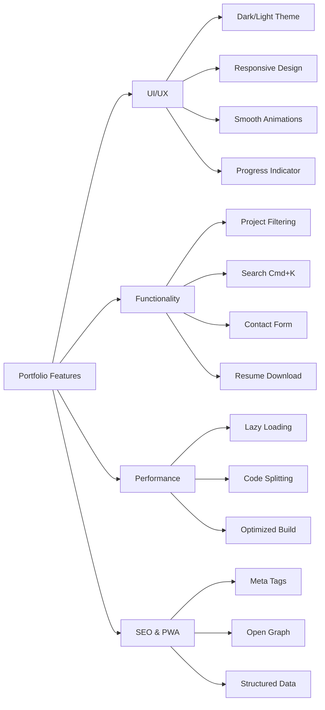
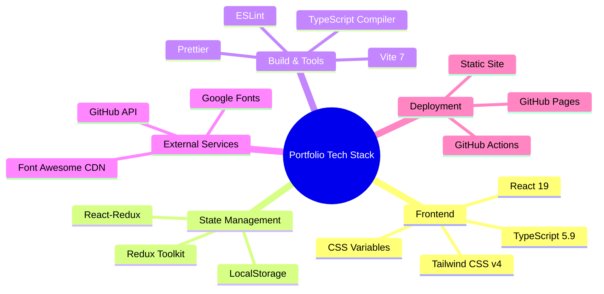
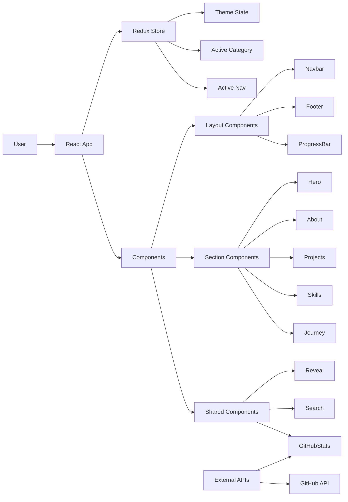
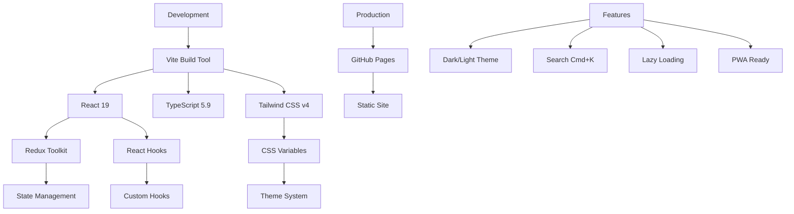

<p align="center">
  <h1 align="center">portfolio</h1>
  <p align="center">
    A personal portfolio website showcasing AI Platform Engineering experience, projects, publications, certifications, and consulting services — built with React, TypeScript, and Tailwind CSS.
  </p>
</p>

<p align="center">
  <a href="https://girijashankarj.github.io/portfolio/"></a>
  <a href="https://github.com/girijashankarj/portfolio"></a>
  
  
  
  
  
</p>

---

## Table of Contents

- [Overview](#overview)
- [Features](#features)
- [Sections](#sections)
- [Tech Stack](#tech-stack)
- [Quick Start](#quick-start)
- [Project Structure](#project-structure)
- [Development](#development)
- [Contributing](#contributing)
- [License](#license)

---

## Overview

**portfolio** is a modern React-based personal portfolio site showcasing AI Platform Engineering expertise, Gen AI tools experience (Flutter Flow, Retool), MLOps (AWS, Databricks), and AI enablement leadership. Built with React 19, TypeScript, Vite, and Tailwind CSS v4. Deployed on GitHub Pages at [girijashankarj.github.io/portfolio](https://girijashankarj.github.io/portfolio/).

Focus areas include AI Platform Engineering, Gen AI adoption, MLOps, Cursor enablement, and production-ready AI systems.

---

## Features



- **Dark/Light theme** — toggle with Redux state and localStorage persistence
- **Scroll progress indicator** — visual reading progress bar
- **Smooth scroll navigation** — anchor-based section navigation with active state
- **Intersection Observer animations** — fade-in effects on scroll
- **Project filtering** — filter projects by category (AI/ML, React/Web, JavaScript, Full Stack, Dev Tools)
- **Search functionality** — Cmd/Ctrl + K to search projects and sections
- **GitHub stats widget** — live GitHub repository statistics
- **Contact form** — sends via Google Apps Script (requires `VITE_NEWSLETTER_SCRIPT_URL` secret)
- **Tech newsletter signup** — same Apps Script; appends to Google Sheet
- **Downloadable resume** — one-click resume download
- **Back to Top button** — smooth scroll to top
- **Responsive design** — mobile-first layout
- **Favicon set** — favicon included
- **SEO optimized** — meta tags, Open Graph, structured data, sitemap
- **TypeScript** — full type safety
- **Redux Toolkit** — state management for theme and filters
- **Error boundary** — graceful error handling

---

## Sections

| Section                       | Description                              |
| ----------------------------- | ---------------------------------------- |
| **About**                     | AI Platform Engineering background       |
| **Skills & Stack**            | Technical skills and tools               |
| **Career Journey**            | Timeline with Gen AI and MLOps experience|
| **Projects & Work Samples**   | Categorized projects with filtering      |
| **Writing & Publishing**      | Articles and publications                |
| **Certifications & Academics**| Certifications and education             |
| **Services & Consulting**     | Consulting offerings                     |
| **Contact**                   | Contact information and links            |

---

## Tech Stack



|                  | Details                              |
| ---------------- | ------------------------------------ |
| **Framework**    | React 19                             |
| **Language**     | TypeScript 5.9                       |
| **Build Tool**   | Vite 7                               |
| **Styling**      | Tailwind CSS v4                      |
| **State**        | Redux Toolkit                        |
| **Fonts**        | Google Fonts (Fraunces, Quicksand)   |
| **Icons**        | Font Awesome 6.5                     |
| **Deployment**   | GitHub Pages                         |

---

## Quick Start

**Prerequisites**: Node.js >= 20.19 (recommended: v24.13.0), npm >= 10

```bash
# Clone the repo
git clone https://github.com/girijashankarj/portfolio.git
cd portfolio

# Install dependencies
npm install

# Start development server
npm run dev

# Build for production (with GitHub Pages base path)
GITHUB_PAGES=true npm run build

# Preview production build
npm run preview
```

**Note**: The old `index.html` file has been replaced by the React version. The React app uses `public/index.html` as the template.

---

## Project Structure

```mermaid
graph TD
    A[portfolio/] --> B[public/]
    A --> C[src/]
    A --> D[Config Files]
    
    B --> B1[index.html]
    B --> B2[robots.txt]
    B --> B3[sitemap.xml]
    
    C --> C1[components/]
    C --> C2[hooks/]
    C --> C3[store/]
    C --> C4[types/]
    C --> C5[common/]
    C --> C6[utils/]
    C --> C7[App.tsx]
    C --> C8[main.tsx]
    C --> C9[index.css]
    
    C1 --> C1A[layout/]
    C1 --> C1B[sections/]
    C1 --> C1C[shared/]
    
    C1A --> C1A1[Navbar.tsx]
    C1A --> C1A2[Footer.tsx]
    C1A --> C1A3[ProgressBar.tsx]
    
    C1B --> C1B1[Hero.tsx]
    C1B --> C1B2[About.tsx]
    C1B --> C1B3[Projects.tsx]
    C1B --> C1B4[Skills.tsx]
    C1B --> C1B5[Journey.tsx]
    C1B --> C1B6[Certifications.tsx]
    C1B --> C1B7[Contact.tsx]
    C1B --> C1B8[...]
    
    C1C --> C1C1[Reveal.tsx]
    C1C --> C1C2[Search.tsx]
    C1C --> C1C3[BackToTop.tsx]
    C1C --> C1C4[GitHubStats.tsx]
    
    C2 --> C2A[useCountUp.ts]
    C2 --> C2B[useIntersectionObserver.ts]
    
    C3 --> C3A[index.ts]
    C3 --> C3B[portfolioSlice.ts]
    
    C4 --> C4A[index.ts]
    
    C5 --> C5A[constants.ts]
    
    C6 --> C6A[sanitizeHtml.ts]
    
    D --> D1[vite.config.ts]
    D --> D2[tsconfig.json]
    D --> D3[package.json]
```



## Architecture Overview



## Tech Stack Flow



---

## Development

### Available Scripts

- `npm run dev` - Start development server
- `npm run build` - Build for production
- `npm run preview` - Preview production build
- `npm run lint` - Run ESLint
- `npm run lint:fix` - Fix ESLint errors
- `npm run format` - Format code with Prettier
- `npm run format:check` - Check code formatting

### Adding New Sections

1. Create a new component in `src/components/sections/`
2. Import and add it to `src/App.tsx`
3. Add navigation item to `src/common/constants.ts` if needed

### Adding Projects

Edit `src/common/constants.ts` and add projects to the `PROJECTS` array with appropriate category.

### Newsletter & Contact Form

Forms submit to Apps Script in a hidden iframe—no new tab. Add `VITE_CONTACT_SCRIPT_URL` and `VITE_NEWSLETTER_SCRIPT_URL` to repo secrets.

1. **Contact** — Deploy `apps-script/ContactCode.gs` as web app.
2. **Newsletter** — Deploy `apps-script/NewsletterCode.gs` (bound to Sheet).

---

## Contributing

1. **Fork** the repository
2. **Create** a feature branch: `git checkout -b feature/my-feature`
3. **Make** your changes
4. **Run** linting and formatting: `npm run lint:fix && npm run format`
5. **Commit** and open a Pull Request

---

## License

This project is open source. See the [LICENSE](LICENSE) file for details.

---

<p align="center">
  Built with discipline by <a href="https://github.com/girijashankarj">GarryTJ</a>
</p>
